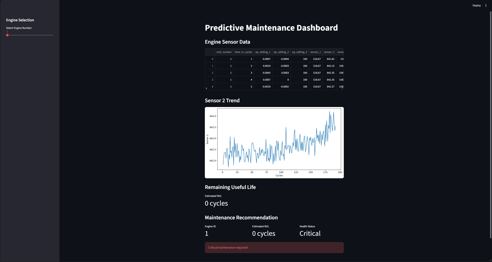
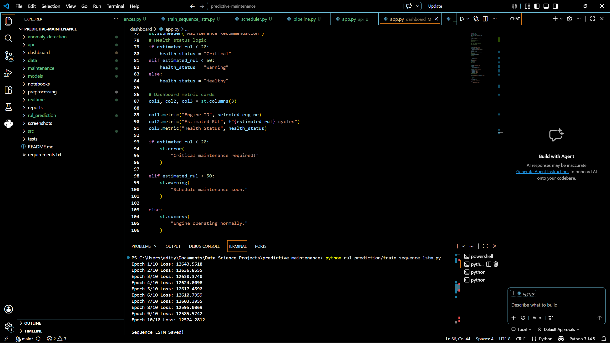

# Predictive Maintenance System

An end-to-end predictive maintenance system using machine learning and deep learning techniques to estimate Remaining Useful Life (RUL) of industrial engines.

## Features
- Anomaly Detection
- LSTM-based RUL Prediction
- FastAPI Backend
- Streamlit Dashboard
- Real-time Monitoring
- Maintenance Recommendation Engine

## Tech Stack
- Python
- Pandas
- NumPy
- PyTorch
- Streamlit
- FastAPI
- Matplotlib

## Project Structure
Predictive-Maintenance-System/
│
├── anomaly_detection/
├── api/
│   └── app.py
│
├── dashboard/
│   └── app.py
│
├── data/
│   ├── train_FD001.txt
│   ├── test_FD001.txt
│   ├── RUL_FD001.txt
│   ├── processed_train.csv
│   └── processed_test.csv
│
├── maintenance/
├── models/
├── notebooks/
├── preprocessing/
├── realtime/
├── rul_prediction/
├── screenshots/
│
├── src/
│   ├── pipeline.py
│   └── __init__.py
│
├── requirements.txt
└── README.md

## Dashboard Preview

### Main Dashboard

### Engine 100 Analysis

### LSTM Training

### Project Structure

